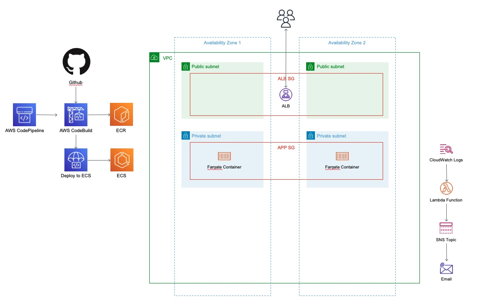
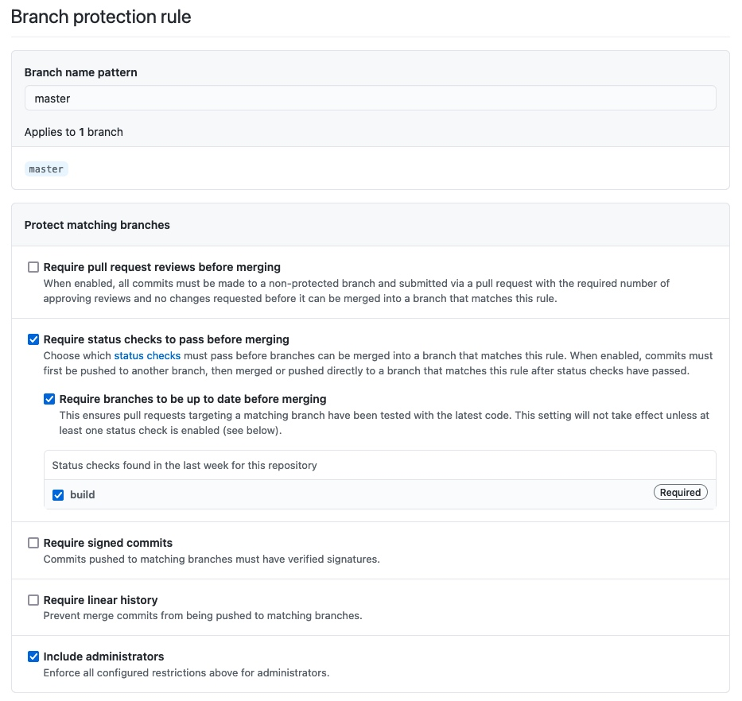
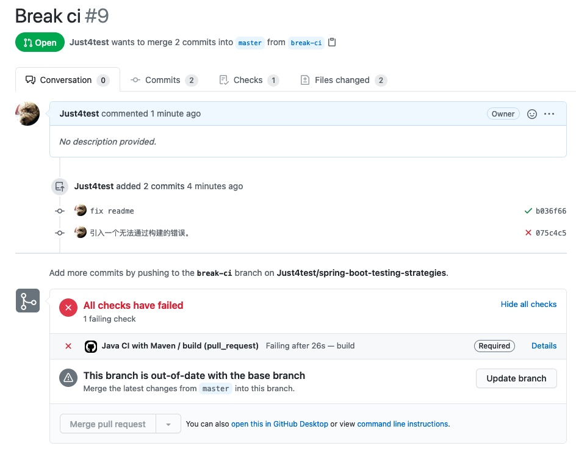

# Q2详解
应用代码位于 [https://github.com/Just4test/spring-boot-testing-strategies](https://github.com/Just4test/spring-boot-testing-strategies)
该应用的构建脚本和Dockerfile见应用代码根目录。
创建Infra的代码见`infra`目录。CI/CD使用该代码自动创建的CodePipeline。

## 设计
1. 使用Github Actions 管理代码合并。因为应用代码由Github托管，而Actions与代码仓库紧密集成。
2. 将服务的构建脚本和Dockerfile直接添加到代码根目录，以便使该系统实现起来比较简单。
3. 使用CodeBuild、CodePipeline构建和部署代码。这是一套无服务器方案，并且不需要手动管理IAM ACCESS KEY。
4. 使用CloudWatch日志组的“订阅筛选条件”筛选日志中的“Error”字符，并触发Lambda，Lambda再将消息转发给SNS。订阅筛选条件只能简单地进行大小写敏感的字符匹配，如果需要更多的日志分析，则应考虑将全量日志流式传输到Lambda。

## 架构图



## 代码仓库与单元测试
在其中添加了一个workflow[描述文件](https://github.com/Just4test/spring-boot-testing-strategies/blob/master/.github/workflows/maven.yml)，或见当前项目中的[github-workflows/maven.yml](github-workflows/maven.yml)。该文件可以启用单元测试。

在代码仓库设置页面启用对master的分支保护，并按如下方式配置。这可以阻止直接推送代码到master，只能通过pull request；而且只有通过单元测试的pull request才能合并。


如果一个PR无法通过单元测试，将禁止merge。



## 部署基础设施
### 部署前准备
基础设施中的构建系统依赖Github连接应用程序；请在即将部署基础设施的Region中通过AWS Web控制台授权Github应用程序访问你的Github代码仓库。
另外，你可能需要fork我的代码仓库到自己的账户中才能正常使用。
在infra目录下创建名为`.env`的文件，并填写如下内容：：
```
export CODE_STAR_CONNECTION_ARN=你刚刚创建的Github应用程序ARN
export GITHUB_OWNER=你的Github用户名
```
### 通过CDK部署基础设施
首先确保当前环境安装了CDK。然后在项目目录执行 `make i && make infra`，将自动创建几乎所有基础设施；服务也将开始运行，不过运行的是标准tomcat，因为尚未构建服务镜像。
### 部署后的调整
手动执行CodePipeline以构建镜像并部署到ECS服务，或者在Github上合并PR以触发CodePipeline。然后就可以访问以下地址：
```
http://your-alb-domain/superheroes/1
```
可以看到返回一个JSON，说明服务工作正常。

你可能会注意到该服务每过一段时间会重启，这是因为服务本身不响应ALB的运行状况检查。可以手动将目标组的运行状况检查路径更改为`/superheroes/1`。

手动向SNS主题添加一个邮件订阅。需要在邮箱中确认该订阅才能生效。然后可以访问以下地址以触发错误日志：
```
http://your-alb-domain/superheroes/0
```
一封错误邮件将发送到邮箱中。